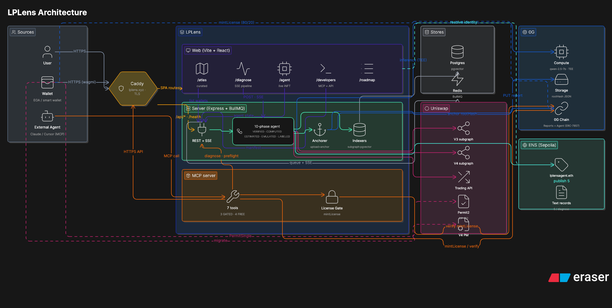

# LPLens ([lplens.xyz](https://lplens.xyz))

### The autonomous LP-rescue agent for Uniswap V3 / V4. Runs on the full 0G stack, with its own ENS name and on-chain memory.

Most Uniswap LPs lose money and never know why. LPLens diagnoses any V3 or V4 position you hold, explains *why* it's bleeding (range, regime, MEV, hook behavior), backtests every candidate V4 hook against the pool's real swap history, and offers a one-click Permit2 migration to the hook that would have earned you more. The agent never executes, you keep custody and sign a single Permit2 typed-data.

Every numeric value in the report carries an honesty label (`VERIFIED` · `COMPUTED` · `ESTIMATED` · `EMULATED` · `LABELED`) so you can tell at a glance which claims trace back to chain-state and which are heuristics. Every finished report is signed by a TEE-attested 0G Compute provider, pinned to 0G Storage with a merkle rootHash, anchored on 0G Chain through the `LPLensReports` registry, and indexed under the agent's own ENS name (`lplensagent.eth` on Sepolia), five independent verification surfaces, no LPLens server in the trust path.

The agent has its own ERC-7857-style iNFT (`LPLensAgent` tokenId 1 on 0G Newton). Its `memoryRoot` advances with each diagnose; its `migrationsTriggered` counter increments when a user actually signs the Permit2 bundle; third-party agents pay to call it via `mintLicense`, the contract auto-splits 80/20 between iNFT owner and protocol treasury.

Built for [ETHGlobal Open Agents](https://ethglobal.com/events/openagents), Apr 24 to May 6 2026. Scope: Ethereum mainnet (chainId 1); multi-chain V4 is a documented follow-up.

---

## What the platform does

| Feature | Description |
| --- | --- |
| Position Atlas | Connect wallet → list every V3 / V4 LP position with a green / amber / red health indicator (percent in-range + IL direction). Six curated demo wallets pinned for the live demo |
| LP Diagnostic Agent | 10-phase pipeline streamed over SSE: position resolution → IL decomposition → regime classification → V4 hook discovery → hook scoring (AT-2 swap replay) → migration preview → TEE verdict → 0G Storage upload → 0G Chain anchor → ENS publish |
| V4 Hook Replay | Replays the pool's last 1 000 mainnet swaps swap-by-swap through `SwapMath.computeSwapStep` for each candidate hook, AT-2 anchors the primitive at **0 bps drift** vs on-chain post-swap state |
| One-click Permit2 Migration | Builds the atomic `close V3 → swap → mint V4` bundle as a Permit2 EIP-712 `PermitSingle`. User signs once. The signed digest is posted back so the iNFT's `migrationsTriggered` counter increments on chain |
| Signed Report | Verdict JSON pinned to 0G Storage, signed inside a 0G Compute TEE, anchored on 0G Chain via `LPLensReports.publishReport`. Permanent `/report/:rootHash` viewer |
| iNFT Agent Identity | `LPLensAgent` ERC-7857 on 0G Newton. Each diagnose calls `updateMemoryRoot` + `recordDiagnose` so `agents(1).memoryRoot` always points at the latest report |
| iNFT Royalty Licensing | Third-party agents pay in OG via `mintLicense(tokenId, licensee, expiresAt)`. Contract atomically splits 80 % to iNFT owner, 20 % to protocol treasury. MCP server enforces `isLicensed` before streaming |
| ENS Output Index | 5 text records published per diagnose under [`lplensagent.eth`](https://sepolia.app.ens.domains/lplensagent.eth) keyed `lplens.<tokenId>.{rootHash, storageUrl, anchorTx, chainId, verdict}`, any agent enumerates this agent's reports without trusting the LPLens API |
| MCP Server | 6 stdio tools for Claude / Cursor / autonomous agents : `lplens.diagnose`, `preflight`, `migrate`, `lookupReport`, `lookupReportOnChain`, `resolveEnsRecord` |

---

## Architecture overview



**High-level flow**

1. Inputs (User, Wallet, External MCP agent) hit a single Caddy entry on `lplens.xyz`. Caddy fans the request to the React SPA, the Express API, or the MCP server.
2. User clicks a position → frontend opens a typed SSE stream to `/api/diagnose/:tokenId` → Express enqueues a BullMQ job.
3. Worker runs the 10-phase pipeline (positions resolved from V3 / V4 subgraphs + on-chain `PositionManager` reads, IL from `SqrtPriceMath`, regime from realized vol / Hurst / linreg, hooks decoded from the 14-bit permission bitmap, scoring from a swap-by-swap replay anchored at 0 bps by AT-2, migration preview from Uniswap Trading API + Permit2).
4. Verdict synthesized by 0G Compute (TEE-attested `qwen-2.5-7b-instruct`) with the AT-4 hallucination guard masking unsupported claims **before** anchoring.
5. Report uploaded to 0G Storage (rootHash) → anchored on 0G Chain (`LPLensReports`) → iNFT memoryRoot bumped → 5 ENS text records published on Sepolia.
6. User signs the Permit2 bundle → server records the digest via `LPLensAgent.recordMigration(tokenId, digest)` → on-chain proof the diagnosis led to a real signed action.

---

## Tech stack

**Core :** TypeScript, Node 20, pnpm workspaces.

**Frontend :** React 18, Vite, TailwindCSS, Radix UI, React Flow, React Router, @tanstack/react-query, wagmi + viem, lucide-react.

**Backend :** Express, Prisma (PostgreSQL + pgvector), BullMQ (Redis), Zod, Winston.

**AI :** LangChain (orchestration), OpenAI (embeddings), 0G Compute broker (TEE inference for verdicts, `qwen-2.5-7b-instruct`).

**Web3 :** viem, Foundry (contracts), `@uniswap/v3-sdk`, `@uniswap/v4-sdk`, Uniswap Trading API, Permit2.

**0G stack :** `@0glabs/0g-serving-broker` (Compute), `@0gfoundation/0g-ts-sdk` (Storage). 0G Newton testnet chain-id 16602.

**MCP :** `@modelcontextprotocol/sdk`, standalone server exposing 6 tools.

**Infra :** Docker Compose (postgres + redis + server + web + caddy), Foundry tests, Vitest, Playwright E2E.

---

## The honesty layer

Every numeric value in a LPLens report is **labeled**, never present an estimate as a fact :

| Label | Meaning | Example |
| --- | --- | --- |
| **VERIFIED** | Read directly on-chain or from canonical subgraph | `liquidity = 83 472 839 …` |
| **COMPUTED** | Derived mathematically from VERIFIED data via Uniswap formulas | `IL_pure_usd = f(liquidity, tickLower, tickUpper, priceNow)` |
| **ESTIMATED** | Heuristic with no ground truth, displayed with a confidence interval | `toxicity_score = 0.087 ± 0.02` |
| **EMULATED** | Result of a simulation of something that did not actually run on-chain | `simulated_apr_in_dynamic_fee_hook = +18.6 %` (with `warnings[]`) |
| **LABELED** | Manual curation | `hook_family = "JIT_PROTECTED"` |

The AT-4 hallucination guard runs *before* anchoring, every `$` / `%` / hex claim in the LLM verdict is regex-extracted and checked (within ±2 %) against the report payload; unsupported claims are masked `[unsupported]` and the verdict label drops to `EMULATED` with the mismatch list. So even the natural-language verdict cannot fabricate a number that's not in the structured data.

---

## Reliability acceptance tests

Six blocking tests gate any signed report :

- **AT-1 IL invariants**, three properties of `computeIL` + one calibration fixture (V3 position, hand-checked) hold within 1 %. `packages/agent/test/IL.invariants.test.ts`.
- **AT-2 swap replay drift**, `SwapMath.computeSwapStep` replayed against the last 1 000 USDC/WETH 0.05 % mainnet swaps with per-block liquidity reads, final `sqrtPriceX96` matches on-chain post-swap value **bit-perfectly, 0 bps drift across 1 000 swaps**. `packages/agent/test/at2.swap-replay.test.ts`.
- **AT-3 regime classifier**, directionality on three synthetic fixtures (mean-reverting / trending / JIT-dominated). `packages/agent/test/regime.fixture.test.ts`.
- **AT-4 LLM no-hallucination**, every number in the verdict markdown traces back to the input JSON. Wired inline on phase 10.
- **AT-5 on-chain anchor round-trip**, against the deployed `LPLensReports` registry. `packages/agent/test/at5.onchain-roundtrip.test.ts`.
- **AT-6 Permit2 EIP-712 signature**, signs synthetic `PermitSingle` typed data, recovers the signer offline via `viem`. `apps/web/test/permit2.eip712.test.ts`.
- **AT-9 V4 hook flag decoding**, 14-bit bitmap → 7-family classifier on a known mainnet hook. `packages/agent/test/hookFlags.fixture.test.ts`.

---

## Local setup

```bash
git clone git@github.com:JeanBaptisteDurand/Open_Agent_2026.git lplens
cd lplens
pnpm install
cp .env.example .env   # fill DATABASE_URL, THE_GRAPH_KEY, UNISWAP_TRADING_API_KEY, OG_NEWTON_RPC, …
docker compose up -d
pnpm db:migrate
pnpm dev
```

Frontend at `http://localhost:3100`, backend at `http://localhost:3001`, MCP server runs standalone.

---

## Live demo run (proof-of-life)

Captured against tokenId 685602 (USDC/WETH 0.05 %, mainnet). Full report at [`/report/0xd0da9250…87b11`](https://lplens.xyz/report/0xd0da92507e2e16e11315d587c64c60547beaa3c5f9bceb7f67356952deb87b11) :

| Output | Value |
| --- | --- |
| 0G Storage rootHash | [`0xd0da9250…87b11`](https://lplens.xyz/report/0xd0da92507e2e16e11315d587c64c60547beaa3c5f9bceb7f67356952deb87b11) |
| 0G Chain anchor tx | [`0xd7392aa9…0ecbd8e`](https://chainscan-newton.0g.ai/tx/0xd7392aa9dfd4fb1dbae1447bbf901943d7f3816c2639c64a46f45ad140ecbd8e) on `LPLensReports` |
| 0G Compute verdict | model `qwen/qwen-2.5-7b-instruct`, provider `0xa48f0128…2E67836`, broker-signed |
| AT-4 guard | fired live, masks LLM-fabricated numbers with `[unsupported]` |
| iNFT memoryRoot | [`LPLensAgent` tokenId 1](https://chainscan-newton.0g.ai/address/0x938f3B7841b3faCbBE967F90B548d991e9882c6C), `memoryRoot` updated, `reputation` incremented. Two on-chain txs per diagnose: `updateMemoryRoot` + `recordDiagnose` |
| ENS records | 5 text records under [`lplensagent.eth`](https://sepolia.app.ens.domains/lplensagent.eth) keyed `lplens.605311.{rootHash, storageUrl, anchorTx, chainId, verdict}` |
| iNFT licence mint | 0.1 OG paid → 80/20 split landed on owner + treasury → `isLicensed(1, 0x70997970…79c8)` returns `true`. Tx [`0xe8e55c75…f9e340`](https://chainscan-newton.0g.ai/tx/0xe8e55c7537f1df457cf5ea407707393c75d027983c612c47e5a9884e7cf9e340) |

Independent verification path, anyone with the rootHash can run :

```bash
cast call 0x3b733eC427eeA5C379Bbd0CF50Dc0b931C5E00d3 \
  "reports(bytes32)(address,uint64,uint256,bytes32,bytes)" \
  0x5b7b82f5d11186e684cbec10be64629b236e9a60cb6c7db924d18ccf8c574d75 \
  --rpc-url https://evmrpc-testnet.0g.ai
```

Or via the MCP tool `lplens.lookupReportOnChain` / `lplens.resolveEnsRecord`, no LPLens server in the trust path.

---

## Deployed contracts

| Network | Contract | Address |
| --- | --- | --- |
| 0G Newton (chainId 16602) | `LPLensReports` | [`0x3b733eC4…E00d3`](https://chainscan-newton.0g.ai/address/0x3b733eC427eeA5C379Bbd0CF50Dc0b931C5E00d3) |
| 0G Newton (chainId 16602) | `LPLensAgent` (iNFT) | [`0x938f3B78…82c6C`](https://chainscan-newton.0g.ai/address/0x938f3B7841b3faCbBE967F90B548d991e9882c6C), agent `tokenId 1`, codeImageHash `0x3c89cd0b…39a7c` |
| Sepolia (chainId 11155111) | ENS parent name | [`lplensagent.eth`](https://sepolia.app.ens.domains/lplensagent.eth), resolver `0x8FADE66B…5B7dD` |

See [contracts/DEPLOY.md](contracts/DEPLOY.md) for the one-line deploy command.

---

## MCP server

The agent is callable from any MCP-aware tool over stdio. See [apps/mcp-server/README.md](apps/mcp-server/README.md) for the desktop config.

| Tool | Backend path | What it does |
| --- | --- | --- |
| `lplens.diagnose` | LPLens API, gated by `LPLensAgent.isLicensed(tokenId, caller)` read on 0G RPC **before** the call | Streams the full pipeline over SSE and returns a structured summary. Unlicensed callers get a `paymentRequired` payload listing the contract address + ABI fragment + suggested price |
| `lplens.preflight` | LPLens API (dry-run variant) | "Should I open this position?" check, runs the diagnostic without writing to Storage / Chain / ENS |
| `lplens.migrate` | LPLens API | Returns the Permit2 EIP-712 typed data the caller can sign to execute the V3 → V4 migration. Agent never executes |
| `lplens.lookupReport` | LPLens API | Fetches a permanent report by rootHash (Postgres index + Storage blob) |
| `lplens.lookupReportOnChain` | 0G Chain RPC direct, no LPLens API in the path | Reads `LPLensReports.reports(rootHash)` via viem. Works even if LPLens is down |
| `lplens.resolveEnsRecord` | Sepolia ENS resolver direct | Reads any `lplens.<tokenId>.<field>` text record under `lplensagent.eth`. Literally agent discovery via ENS |

Owner of the iNFT is always implicitly licensed; royalty kicks in only on third-party calls. Time-bounded subscription (default 24 h), renewable by re-calling `mintLicense`.

---

## Submission

- **Project Name :** LPLens
- **Tracks :** 0G Best Autonomous Agents, Swarms & iNFT Innovations · Uniswap Foundation Best API Integration · ENS Best for AI Agents
- **Networks :** Ethereum mainnet (data plane) · 0G Newton testnet (Storage / Compute / Chain / iNFT) · Sepolia (ENS)
- **Repository :** [github.com/JeanBaptisteDurand/Open_Agent_2026](https://github.com/JeanBaptisteDurand/Open_Agent_2026)
- **Live Demo :** [lplens.xyz](https://lplens.xyz)
- **Builder feedback :** [FEEDBACK.md](FEEDBACK.md) (Uniswap track requirement)

---

## Project structure

```
Open_Agent_2026/
  apps/
    server/       Backend API + 10-phase pipeline (Express + BullMQ)
    web/          Frontend (React + Vite + wagmi)
    mcp-server/   MCP server for Claude / Cursor / agent integration
  packages/
    agent/        Phase implementations + acceptance tests
    core/         Shared types and utilities
  contracts/      Foundry. LPLensReports + LPLensAgent (ERC-7857)
```

---

## Team

**42 Blockchain**, Jean-Baptiste Durand. Same "Lens" architecture as past finalist projects (BaseLens, CORLens, SuiLens, Devinci-Sui, Panoramix).

| Channel | Handle |
| --- | --- |
| Telegram | `@Beorlor` |
| X | [`@JBD_Dev`](https://x.com/JBD_Dev) |
| GitHub | [`JeanBaptisteDurand`](https://github.com/JeanBaptisteDurand) |
| Email | `jbdurand2000@gmail.com` |

---

## License

MIT, see [LICENSE](LICENSE).
